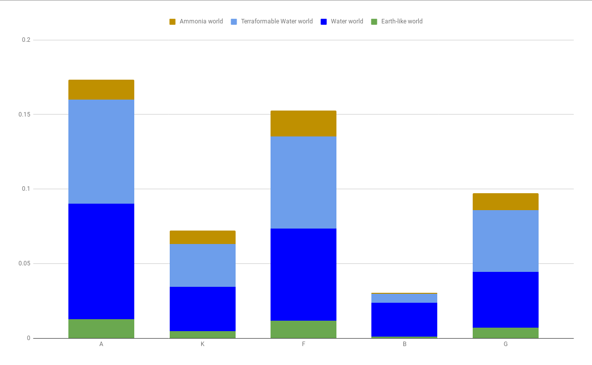

# Elite Dangerous Stats
So i wanted to know the statistics around how often you would find different planetary bodies around which types of stars. All I found by googling was people mentioning vague estimates, and only regarding ELWs.

First we need some data. Someone on the EDAD discord mentioned that the edsm.net api had a simple download for all planetory bodies updated in the last week. Perfect.

It turns out its a 2.6 GB download. o_O

This is going to require some crunching to get around memory limits in the json parser.

## Group by system

First we want to group the bodies by their system. This would be as simple as `gc jsondata | convertfrom-json | group-object systemId64`, but with the large file size the risk of crashing midway through and losing all your progress is enough for me to look for alternative methods.

Luckily, the file holds only one large json array with each object on a separate line. Thus we can go line by line, discard any short lines (those being the starting and ending square brackets of the array), then manually extract the systemId64 property and save the line to a file designated to that system.

	mkdir systems
	get-content ./bodies7days.json | ?{ $_.Length -ge 10 } | %{
		$marker = """systemId64"":"
		$markerindex = $_.indexof($marker)
		$idstart = $markerindex + $marker.length
		if( $markerindex -ne -1 )
		{
			$idend = $_.indexof( ",", $idstart )
			$id = $_.substring( $idstart, $idend-$idstart )
			echo $_ >> "./systems/$id"
		}
	}

Ok, that took about an hour to run. Now we have a couple of thousand files, each containing one system's planetary body information in  almost-json format. (No square brackets)

## Crunch system data

We want all those files to contain just the information relevant to our interests. That means name, id, main star type, and what bodies of each type the system contains.

We also group the systems by their main star type.


	$i = 0
	$systemsdirectory = Resolve-Path "./systems"

	# There are so many files, iterating using gci or ls creates problems (probably because they also do sorting and grabbing metadata). So we use a .net method to just get all full paths, one by one.
	[IO.Directory]::enumeratefiles($systemsdirectory) | %{
		$i++
		if( $i % 10000 -eq 0)
		{
			# write progress indicator every once in a while
			write-host -nonewline "."
		}
		# these files are small enough we can use the regular jsonconverter. Remember to trim the trailing comma.
		$objects = gc $_ | %{ $_.trimend(",") |convertfrom-json}

		# the main star is the one closest to arrival
		$main = $objects | ?{ $_.distanceToArrival -eq 0 }
		if( $main.type -eq "Star" )
		{
			# these are the properties we want to track. Some names exactly match properties in the jsondata, makes it easier to set them later.
			$outputobject = new-object psobject -property @{
				"id"=$main.systemid64;
				"type"=$main.type;
				"subtype"=$main.subtype;
				"name"=$main.systemName;
				"Terraformable High metal content world"=0;
				"Terraformable Rocky body"=0;
				"Terraformable Water world"=0;
				"High metal content world"=0;
				"Class III gas giant"=0;
				"Class I gas giant"=0;
				"Icy body"=0;
				"Rocky body"=0;
				"Metal-rich body"=0;
				"Gas giant with water-based life"=0;
				"Class II gas giant"=0;
				"Water world"=0;
				"Rocky Ice world"=0;
				"Ammonia world"=0;
				"Gas giant with ammonia-based life"=0;
				"Class IV gas giant"=0;
				"Class V gas giant"=0;
				"Earth-like world"=0;
				"Water giant"=0;
				"Helium-rich gas giant"=0;
				"No bodies"=1;
			}

			$objects | %{
				if( $_.terraformingState -eq "Candidate for terraforming" )
				{
					$name = "Terraformable $($_.subtype)"

				}
				else
				{
					$name = $_.subtype
				}
				# propertyname matches the subtype exactly, so we can just use the variable itself to set the property
				if( $outputobject."$name" -eq 0 )
				{
					$outputobject."$name" = 1
					$outputobject."No bodies" = 0
				}
			}

			# group by star type using folders
			$folderlabel = $main.subtype.replace("/","-") # guard against invalid folder name
			if(!(Test-Path "./jsonsystems/$($folderlabel)"))
			{
				mkdir "./jsonsystems/$($folderlabel)"
			}
			$outputobject | convertto-json | set-content "./jsonsystems/$($folderlabel)/$($main.systemid64)"
		}
	}

That took another hour, but now we are closer to the finish line.

## Summarize

Go through the star types, one by one, and count the number of systems in which you can find each type of planetary body.

	mkdir starstats
	$props = @(
		"Terraformable High metal content world",
		"Terraformable Rocky body",
		"Terraformable Water world",
		"High metal content world",
		"Class III gas giant",
		"Class I gas giant",
		"Icy body",
		"Rocky body",
		"Metal-rich body",
		"Gas giant with water-based life",
		"Class II gas giant",
		"Water world",
		"Rocky Ice world",
		"Ammonia world",
		"Gas giant with ammonia-based life",
		"Class IV gas giant",
		"Class V gas giant",
		"Earth-like world",
		"Water giant",
		"Helium-rich gas giant",
		"No bodies"
	)

	gci ./jsonsystems | %{
		write-host "`ndoing $($_.name)"
		$stats = @{
			"Terraformable High metal content world"=0;
			"Terraformable Rocky body"=0;
			"Terraformable Water world"=0;
			"High metal content world"=0;
			"Class III gas giant"=0;
			"Class I gas giant"=0;
			"Icy body"=0;
			"Rocky body"=0;
			"Metal-rich body"=0;
			"Gas giant with water-based life"=0;
			"Class II gas giant"=0;
			"Water world"=0;
			"Rocky Ice world"=0;
			"Ammonia world"=0;
			"Gas giant with ammonia-based life"=0;
			"Class IV gas giant"=0;
			"Class V gas giant"=0;
			"Earth-like world"=0;
			"Water giant"=0;
			"Helium-rich gas giant"=0;
			"No bodies"=0;
			"total"=0;
			"subtype"=$_.name
		}
		[IO.Directory]::enumeratefiles($_.fullname) | %{
			$stats["total"]++;
			if($stats["total"] % 1000 -eq 0)
			{
				write-host -nonewline "."
			}
			$obj = gc $_ | convertfrom-json
			$props | %{
				$stats[$_] += $obj."$_"
			}
		}
		$stats | convertto-json | set-content "./starstats/$($_.name)"
	}

Not quite an hour later. The crunch is done. The rest is quick work.

## CSV

CSV a lie. We use tabs instead of commas because then we can just paste the result into gdocs.

Two versions, the latter only cares about the star type by way of what you can filter on the galaxy screen. The former gives all the details.

	$props = @(
		"Earth-like world",
		"Class IV gas giant",
		"Water world",
		"No bodies",
		"High metal content world",
		"Metal-rich body",
		"Ammonia world",
		"Gas giant with water-based life",
		"Terraformable Rocky body",
		"Rocky Ice world",
		"Rocky body",
		"Class V gas giant",
		"Terraformable High metal content world",
		"Gas giant with ammonia-based life",
		"Class II gas giant",
		"Class III gas giant",
		"Terraformable Water world",
		"Icy body",
		"Water giant",
		"Helium-rich gas giant",
		"Class I gas giant"
	)

	# get one object for each star type with properties for each body type containing the percent chance the body can be found around the star
	$list = gci ./starstats | %{
		$obj = gc $_.fullname | convertfrom-json
		$p = @{"total"=$obj.total;"subtype"=$_.name}
		$props | %{
			$p.Add($_,$obj."$_"/$obj.total)
		}
		new-object psobject -property $p
	}
	$list | convertto-csv -notypeinformation -delimiter "`t" | set-content subtypes.csv

	$result = @{}

	gci ./starstats | %{
		$subtype = $_.name
		$type = $subtype.substring(0,$subtype.indexof(" "))
		if(!($result.ContainsKey($type)))
		{
			$result.Add($type,@{"type"=$type;"total"=0;})
		}
		$obj = gc $_.fullname | convertfrom-json
		$result[$type]["total"] += $obj.total

		$props | %{
			if(!($result[$type].containskey($_)))
			{
				$result[$type].Add($_,0)
			}
			$result[$type][$_] += $obj."$_"
		}
	}

	$result.values | %{
		$v = $_
		$f = @{"type"=$_.type;"total"=$_.total;}
		$props | %{
			$f.Add($_,$v."$_"/$v.total)
		}

		new-object psobject -property $f
	}| convertto-csv -notypeinformation -delimiter "`t" | set-content maintypes.csv

# result

Cut down to just the interesting parts



Some remarks:

* these percentages do not sum to 100%, obviously. A star can have both ELWs and WWs, for example.
* there are variants the stars (like K-giant) with wildly different stats, but you can't filter for them
* remember that these stats are based on what people like to visit, so there is probably a skew towards interesting planetary bodies.

Number of stars of each type:

```
Type                               Total
A (Blue-White super giant) Star       16
A (Blue-White) Star                13447
B (Blue-White super giant) Star       30
B (Blue-White) Star                 2954
Black Hole                           620
CJ Star                                1
CN Star                               29
F (White super giant) Star             8
F (White) Star                     29911
G (White-Yellow super giant) Star      9
G (White-Yellow) Star              23990
Herbig Ae-Be Star                    181
K (Yellow-Orange giant) Star         113
K (Yellow-Orange) Star             71983
L (Brown dwarf) Star                4610
```

tab separated data:
```
type	subtype	Class I gas giant	Class II gas giant	Class III gas giant	Class IV gas giant	Class V gas giant	Helium-rich gas giant	Gas giant with water-based life	Gas giant with ammonia-based life	Water giant	Rocky body	Rocky Ice world	Icy body	High metal content world	Metal-rich body	Terraformable Rocky body	Terraformable High metal content world	Water world	Ammonia world	Terraformable Water world	Earth-like world
A	A (Blue-White super giant) Star	0	0	0.125	0.3125	0.3125	0	0	0	0	0.25	0	0	0.3125	0.375	0	0	0	0	0	0
A	A (Blue-White) Star	0.05205622072	0.06692942664	0.1182419871	0.03510076597	0.002751543095	0.001561686622	0.06492154384	0.0158399643	0.008254629285	0.2729976947	0.03710864877	0.09779132892	0.3401502194	0.08708262066	0.01554250019	0.163233435	0.07734067078	0.0133115193	0.07005279988	0.01286532312
B	B (Blue-White super giant) Star	0	0.03333333333	0.03333333333	0	0.03333333333	0	0	0	0	0	0	0	0.06666666667	0.03333333333	0	0	0	0	0	0
B	B (Blue-White) Star	0.004739336493	0.01929587001	0.2048070413	0.1418415708	0.03791469194	0.002031144211	0.01895734597	0.002369668246	0	0.2109004739	0.006770480704	0.01557210562	0.3083953961	0.1330399458	0.00778605281	0.03486797563	0.02301963439	0.0006770480704	0.006093432634	0.001015572106
Black	Black Hole	0.1983870968	0.05161290323	0.1596774194	0.06290322581	0.01935483871	0	0.03387096774	0.01612903226	0.004838709677	0.2467741935	0.03387096774	0.3032258065	0.1483870968	0.04193548387	0.03548387097	0.03548387097	0.01451612903	0.004838709677	0.01612903226	0.001612903226
CJ	CJ Star	0	0	0	0	0	0	0	0	0	0	1	0	0	0	0	0	0	0	0	0
CN	CN Star	0.03448275862	0	0.03448275862	0	0	0	0	0.03448275862	0	0.4137931034	0.1724137931	0.2413793103	0.6551724138	0	0.1034482759	0.3793103448	0.03448275862	0	0.1034482759	0.03448275862
F	F (White super giant) Star	0	0.125	0	0	0	0	0	0	0	0.125	0	0	0.25	0.25	0.125	0.125	0	0	0	0.125
F	F (White) Star	0.09354418107	0.05208786065	0.09257463809	0.02049413259	0.001972518471	0.001103273043	0.05566513992	0.02938718197	0.01450971215	0.2510447661	0.07284945338	0.1881582027	0.3413125606	0.09280866571	0.01153421818	0.1505466216	0.06188358798	0.01728461101	0.06181672294	0.01170138076
G	G (White-Yellow super giant) Star	0.1111111111	0	0.3333333333	0.1111111111	0.1111111111	0	0	0	0	0.3333333333	0	0	0.3333333333	0.1111111111	0	0	0	0	0	0
G	G (White-Yellow) Star	0.1194664444	0.04364318466	0.07711546478	0.01162984577	0.0008753647353	0.0005002084202	0.04835348062	0.03776573572	0.005210504377	0.2	0.08015839933	0.2422676115	0.3051688203	0.1034597749	0.002709462276	0.1051688203	0.0372655273	0.0115464777	0.04147561484	0.007127969987
Herbig	Herbig Ae-Be Star	0.2375690608	0.09944751381	0.2596685083	0.1325966851	0.02762430939	0.005524861878	0.09392265193	0.08839779006	0.04972375691	0.0773480663	0.02209944751	0.2928176796	0.2375690608	0.03314917127	0.005524861878	0.02762430939	0.04972375691	0.03314917127	0.005524861878	0
K	K (Yellow-Orange giant) Star	0	0	0.1946902655	0.1504424779	0.008849557522	0	0.01769911504	0	0	0.4159292035	0.008849557522	0.04424778761	0.4778761062	0.1504424779	0	0.05309734513	0.01769911504	0	0.008849557522	0
K	K (Yellow-Orange) Star	0.1199310948	0.03809232736	0.05861106094	0.005015073003	0.0005140102524	0.0001805981968	0.03943986775	0.02445021741	0.0005001180834	0.12496006	0.07721267521	0.2432657711	0.2893738799	0.06439020324	0.0007918536321	0.0615423086	0.0295625356	0.008988233333	0.02889571149	0.004890043482
L	L (Brown dwarf) Star	0.04403470716	0.001735357918	0.001084598698	0.0002169197397	0	0	0.001735357918	0.001735357918	0	0.00715835141	0.01171366594	0.2414316703	0.05835140998	0	0	0.003253796095	0.003470715835	0.001084598698	0.0008676789588	0
```
